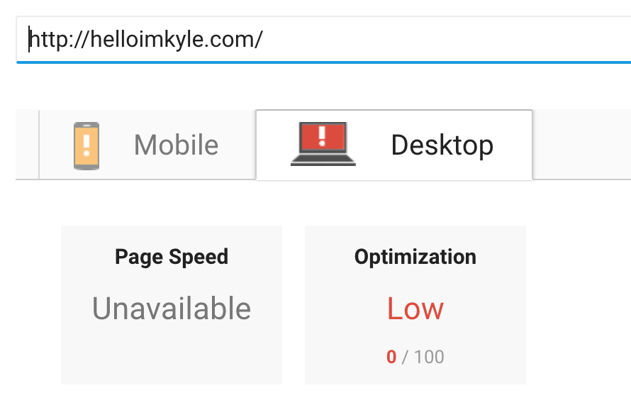
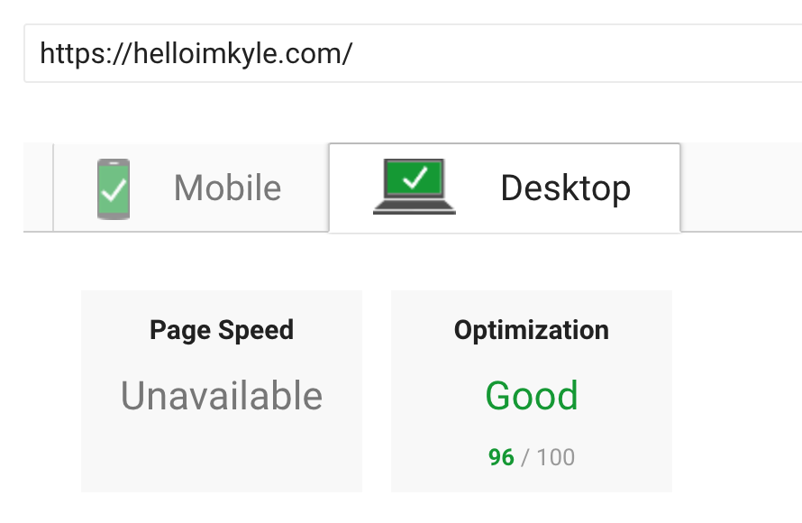

My first go at a personal website was done with about 3 months of every day coding under my belt, and just used regular HTML, CSS, and a little bit of jQuery. Fast forward to today, and it has been just over year since I finished a coding bootcamp. What a perfect time to dust off and redo my portfolio website. With this make over I wanted to accomplish a couple of things. Increasing the speed was at the top of the list, incorporate a blog, and display side projects that use modern technology that I couldn't show experience with at my job.

## Enter Gatsby

My first introduction to Gatsby was a few months ago when YouTube videos were on auto play in the background. I was instantly interested and wanted to get my hands dirty. My initial first go with it was to try and remake my wife's business wordpress site. Distractions and getting side tracked got me off of that project (however, it's on deck for me now) and I moved on. When I decided it was time to redo my portfolio site, I knew I would give Gatsby a go.

## Speed

 _Pagespeed before redo with Gatsby._

As you can see, even a slight speed increase would be a win for me, as my v1 of my personal site wasn't even registering a speed on desktop. For mobile, I was clocking in at around 70 the handful of times I ran the test.

Out of the box, and with practically zero configuration, Gatsby helps with code splitting. This insures that only the critical HTML, CSS, data, and JavaScript is loaded on each page. Also, prefetching is enabled, so when you navigate to other pages your site feels amazingly fast.

Additionally, I used the `gatsby-plugin-sharp` and `gatsby-transformer-sharp` plugins to help with generating responsive images. Not only are multiple sizes of your images generated to help serve the right one, you also have a handful of loading filters. I went with the default 'blur-up' method which Facebook and Medium made popular.

These were the only two main emphasizes that I put on increasing speed, and take a look at these results! Mobile increased to 90, and desktop went from 0 to 96.

 _Pagespeed after redo with Gatsby._
