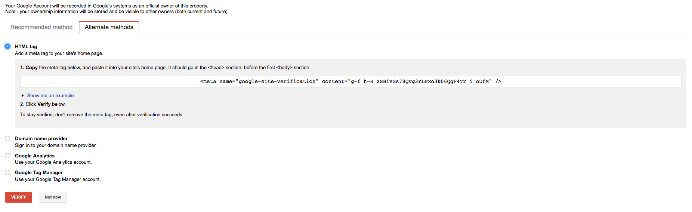

To verify my Gatsby site with Google Webmasters I used the HTML meta tag option. There are other options like uploading an HTML file to your domain, signing in to your domain name provider, or using your Google Analytics or Tag Manager account.

**[Make sure to also include the Gatsby sitemap generator plugin](https://github.com/gatsbyjs/gatsby/tree/master/packages/gatsby-plugin-sitemap)** 

## Add Property to Search Console
When you log into the Search Console you will be able to "Add A Property". Enter your domain name, including the full path and protocol, I set up two properties (https://mysite.com and https://www.mysite.com).

## Selecting a Verification Method

> Click to Enlarge

After you enter a domain, you will see a screen similar to the picture above. Click on the 'Alternate methods' tab and select the first option, HTML tag. Google will provide a meta tag snippet like this:
```HTML
<meta name="google-site-verification" content="g-f_h-H_zSBivGs78Qvg3rLPxo3k06QqF4rr_i_oUfM" />
```
You won't actually copy and paste this meta tag, but you will need the name and content values to include on your Gatsby site.

## Editing React Helmet Props
Using the values from the meta tag, you will want to edit the `<Helmet>` component. If you started with the basic Gatsby build, this will be located in the `src/layouts/index.js` file. Add a new object into the meta array prop, with the name and content values.

```javascript
<Helmet
    title={data.site.siteMetadata.title}
    meta={[
    { name: 'description', content: 'Your description here' },
    { name: 'google-site-verification', content: 'sg74inu3b2a9_jQhpJVCjJlom9daF79YSGoTzqsxZEc' }
    ]}
/>
```

## Benefits of Verifying Your Gatsby Site
If you are using Gatsby to build a blog, and want to generate more traffic, you will definitely want to utilize Google Webmaster. The Search Console will track Google search traffic to a higher degree than the standard Google Analytics will. You can see things like clicks, impressions, position, and CTR (click through rate) for specific queries, pages, devices, and search types. With this search data paired with your analytic data, you can make refinments and generate a greater traffic flow.